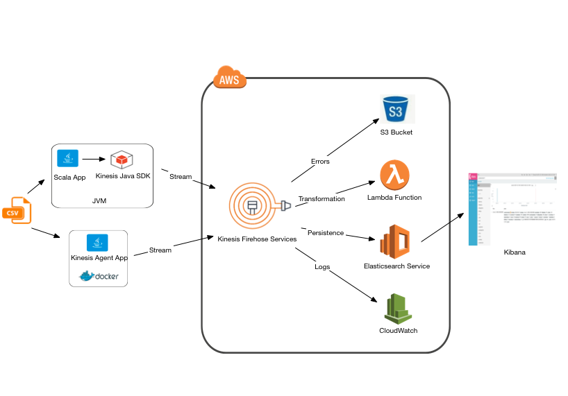

<!-- TOC depthFrom:1 depthTo:6 withLinks:1 updateOnSave:1 orderedList:0 -->

- [Overview](#overview)
	- [How it Works](#how-it-works)
- [Pre-Requisites](#pre-requisites)
	- [Elastisearch & Kibana](#elastisearch-kibana)
		- [Elastisearch Instance](#elastisearch-instance)
		- [Kibana Instance](#kibana-instance)
	- [Elastisearch Data Mapping](#elastisearch-data-mapping)
	- [Elastisearch Indexes](#elastisearch-indexes)
- [End-to-end Testing](#end-to-end-testing)
	- [Data Streaming Using the Scala Application](#data-streaming-using-the-scala-application)
		- [Run the Junit Test](#run-the-junit-test)
		- [Run Using Gradle](#run-using-gradle)
		- [Run as a Stand-alone Java Application](#run-as-a-stand-alone-java-application)
	- [Data Streaming Using the Kinesis Agent](#data-streaming-using-the-kinesis-agent)
- [Using Kibana to Query Data](#using-kibana-to-query-data)

<!-- /TOC -->

# Overview
This project demonstrates the use of [Amazon Kinesis Data Streams](https://aws.amazon.com/kinesis/?hp=tile&so-exp=below) for stream data processing. The sample CSV data is from the [Bureau of Transportation Statistics](https://www.transtats.bts.gov/databases.asp?Mode_ID=1&Mode_Desc=Aviation&Subject_ID2=0) and contains Airline on-time performance statistical data. The data schema is documented [here](http://stat-computing.org/dataexpo/2009/the-data.html)

Sample data read from a CSV file is streamed to Kinesis Firehose Endpoint using the [Kinesis Firehose SDK](https://docs.aws.amazon.com/firehose/latest/dev/writing-with-sdk.html). The CSV data is then transformed to JSON using an [Amazon Lambda Function](https://docs.aws.amazon.com/lambda/latest/dg/welcome.html) and sent back to the Kinesis Endpoint where it gets sent to an [Amazon Elastisearch Service](https://docs.aws.amazon.com/elasticsearch-service/latest/developerguide/what-is-amazon-elasticsearch-service.html) Endpoint for ingestion.

Use of Amazon Kinesis services can be an alternative approach to using stream processing using [Kafka and Spark Streaming](https://github.com/doinotlikeit/spark-stream-processor).

  


----


## How it Works
* Data can be streamed to Kinesis Firehose using two mechanisms:
  * By running the `KinesisClientApp` as a stand-alone Java application at the command line
  * By staring a Docker container which runs the Kinesis Agent

  Both methods reads the CSV file(s) and streams their contents to the Kinesis Firehose Endpoint. Any processing errors are logged in S3

* The Kinesis Data Streams Endpoint receives the streamed input data and invokes the Lambda Java Function which transforms CSV data to a JSON schema that can be ingested to Elastisearch. Debug log output from the Lambda function can be accessed from the CloudWatch service

* Firehose service then sends the transformed JSON data to the Elastisearch Service endpoint which indexes the input data by automatically creating new indexes

* Data can queried, analysed, and viewed from the Kibana web console


----


# Pre-Requisites

## Elastisearch & Kibana

### Elastisearch Instance

### Kibana Instance

* Verify Kibana access by pointing your browser to `localhost:5601`

* Goto the `Dev Tools` tab on Kibana and execute the query below. If the query executes successfully, then you have a running Elastisearch and Kibana instances.
  ```
  GET _search
  {
    "query": {
    "match_all": {}
    }
  }
  ```

## Elastisearch Data Mapping
* Elastisearch data mapping is explained [here](https://www.elastic.co/guide/en/elasticsearch/reference/current/mapping.html).

* Goto `Dev Tools` on Kibana and execute the mapping query below by replacing the `[QUERY_JSON_STRING]` section with the contents of the `[PATH_TO_PROJ_DIR]/data/es-mapping.json` file.

  ```
  PUT _template/data-template

    [QUERY_JSON_STRING]

  ```


## Elastisearch Indexes


----


# End-to-end Testing
>
> Be sure to complete all requirements in the Pre-Requisites section.
>

## Data Streaming Using the Scala Application
The Scala Application `KinesisClientApp` scans a specified directory for CSV data files, reads their contents and streams their contents using the Kinesis Client SDK.

### Run the Junit Test
  ```
    [PATH_TO_PROJ_DIR]/gradlew clean test
    Java HotSpot(TM) 64-Bit Server VM warning: ignoring option MaxPermSize=128M; support was removed in 8.0
    Starting a Gradle Daemon (subsequent builds will be faster)

    > Task :compileScala
    Pruning sources from previous analysis, due to incompatible CompileSetup.

    > Task :compileTestScala
    Pruning sources from previous analysis, due to incompatible CompileSetup.

    > Task :test

    LambdaTest > createHandlerTest STARTED

    LambdaTest > createHandlerTest STANDARD_OUT
        ##-> 12:54:45.197 Test worker - INFO - LambdaTest: ==> Initialised ...
        ##-> 12:54:45.199 Test worker - INFO - LambdaTest: ==> Running test ...

    LambdaTest > createHandlerTest PASSED

    LambdaTest > handlerInvocationTest STARTED

    LambdaTest > handlerInvocationTest STANDARD_OUT
        ##-> 12:54:45.439 Test worker - INFO - LambdaTest: ==> Initialised ...
        ##-> 12:54:45.477 Test worker - INFO - LambdaTest: ==> Sending test data: {invocationId=a4e9d125-8831-4840-8b13-5be1a41660c5, deliveryStreamArn=arn:aws:firehose:us-west-2:301286612886:deliverystream/its-demo-kinesis-firehose, region=us-west-2, records=[{recordId=49580249382472375720749578939849415291010732558131396610000000, approximateArrivalTimestamp=1514652614490, data=MjAwOCwxLDMsNCwyMDAzLDE5NTUsMjIxMSwyMjI1LFdOLDMzNSxONzEyU1csMTI4LDE1MCwxMTYsLTE0LDgsSUFELFRQQSw4MTAsNCw4LDAsLDAsTkEsTkEsTkEsTkEsTkE=}]} to Lambda Handler
        ##-> 12:54:45.617 Test worker - INFO - c.its.demo.kinesis.data.TestContext: ==> Created an EventData object
        ##-> 12:54:46.199 Test worker - INFO - c.its.demo.kinesis.data.TestContext: *** Records to return: com.its.demo.kinesis.KinesisDataRecords@4c74b3c4
        ##-> 12:54:46.199 Test worker - INFO - c.its.demo.kinesis.data.TestContext: *** Handler call count: 1
        ##-> 12:54:46.202 Test worker - INFO - LambdaTest: ==> Record id: 49580249382472375720749578939849415291010732558131396610000000, Result: Ok, data: eyJldmVudFR5cGUiOiJHT09EX0RBVEFfUkVDIiwidGltZXN0YW1wIjoiMjAwOC0wMS0wM1QwMDowMCIsImFjdHVhbERlcFRpbWUiOiIyMDAzIiwiQ1JTRGVwVGltZSI6IjE5NTUiLCJhcnJUaW1lIjoiMjIxMSIsIkNSU0FyclRpbWUiOiIyMjI1IiwiY2FycmllckNvZGUiOiJXTiIsImZsaWdodE51bWJlciI6IjMzNSIsInRhaWxOdW1iZXIiOiJONzEyU1ciLCJhY3R1YWxFbGFwc2VkVGltZSI6MTI4LCJDUlNFbGFwc2VkVGltZSI6MTUwLCJhaXJUaW1lIjoxMTYsImFycml2YWxEZWxheSI6LTE0LCJkZXBhcnR1cmVEZWxheSI6OCwib3JpZ2luIjoiSUFEIiwiZGVzdGluYXRpb24iOiJUUEEiLCJkaXN0YW5jZSI6ODEwLCJ0YXhpSW4iOjQsInRheGlPdXQiOjgsImNhbmNlbGxlZCI6MCwiY2FuY2VsbGF0aW9uQ29kZSI6Ik5BIiwiZGl2ZXJ0ZWQiOjAsImNhcnJpZXJEZWxheSI6MCwid2VhdGhlckRlbGF5IjowLCJOQVNEZWxheSI6MCwic2VjdXJpdHlEZWxheSI6MCwibGF0ZUFpcmNyYWZ0RGVsYXkiOjB9
        ##-> 12:54:46.203 Test worker - INFO - LambdaTest: ==> Test Done ...

    LambdaTest > handlerInvocationTest PASSED
  ```

### Run Using Gradle
  ```
    [PATH_TO_PROJ_DIR]/gradlew clean run
    Java HotSpot(TM) 64-Bit Server VM warning: ignoring option MaxPermSize=128M; support was removed in 8.0

    > Task :compileScala
    Pruning sources from previous analysis, due to incompatible CompileSetup.

    > Task :run
    ##-> 22:35:18.120 main - INFO - c.its.demo.kinesis.KinesisClientApp$: ==> Created the Firehose client, data directory to scan: [/Users/coorayr/its/demo/kinesis-stream-processing/data] ...
    ##-> 22:35:18.127 pool-2-thread-1 - INFO - c.its.demo.kinesis.DirectoryScanner: ===> Thread [pool-2-thread-1], Scanning: /Users/coorayr/its/demo/kinesis-stream-processing/data ...
    ##-> 22:35:18.140 pool-2-thread-1 - INFO - c.its.demo.kinesis.DirectoryScanner: ===> Found: 1 files in the source directory: [/Users/coorayr/its/demo/kinesis-stream-processing/data], can read|execute: [true|true]
    ##-> 22:35:18.141 pool-2-thread-1 - INFO - c.its.demo.kinesis.DirectoryScanner: ===> Thread: [pool-2-thread-1], Processing file: [/Users/coorayr/its/demo/kinesis-stream-processing/data/sample.csv]
    ##-> 22:35:18.141 pool-2-thread-1 - INFO - c.its.demo.kinesis.DirectoryScanner: ===> Data file: [sample.csv], size: 0 MB ...
    ##-> 22:35:18.142 pool-2-thread-1 - INFO - c.its.demo.kinesis.DirectoryScanner: Percentage complete: 0%,  Lines in queue: 0, lines read: 0
    ##-> 22:35:18.142 pool-2-thread-1 - INFO - c.its.demo.kinesis.DirectoryScanner: Percentage complete: 9%,  Lines read from file: 54
    ##-> 22:35:18.142 pool-2-thread-1 - INFO - c.its.demo.kinesis.DirectoryScanner: ===> Total lines in file: 54 lines
    ##-> 22:35:18.142 pool-2-thread-1 - INFO - c.its.demo.kinesis.DirectoryScanner: ===> File size: 5203, read size: 5149
    ##-> 22:35:18.142 pool-2-thread-1 - INFO - c.its.demo.kinesis.DirectoryScanner: ===> **********************************************************************************
    ##-> 22:35:18.142 pool-2-thread-1 - INFO - c.its.demo.kinesis.DirectoryScanner: ===> Thread: [pool-2-thread-1], Finished Processing file: [/Users/coorayr/its/demo/kinesis-stream-processing/data/sample.csv]
    ##-> 22:35:18.142 pool-2-thread-1 - INFO - c.its.demo.kinesis.DirectoryScanner: ===> **********************************************************************************
    ##-> 22:35:20.164 main - INFO - c.its.demo.kinesis.KinesisClientApp$: ===> Put record (Async) to Kinesis: Sb5T6esQC6gs+ZHiH8+RwbuWQOLP5BZIvdsKe+5i6uWkES3TVEHEytQTubKD8gMMxWD6s22gReFKDATA2SaJ2N/kMNLdPnA/i4F2nkwMbWgOY/jL69ojuMmFN8K1brCGLf9LV0Tc23Y1Avx2M3okoT2pLC27oERc0S9FnRiSGPi/YbT+eKiW2ZA6QKaEWd5kooQ1Ye8EJm+oVx2opBG56rJnqFbyOKR/ ...
    ##-> 22:35:20.326 main - INFO - c.its.demo.kinesis.KinesisClientApp$: ===> Put record (Async) to Kinesis: DsFp0sqacR0+XP77axYPGeJzoqsyDHOYaybZSvAA3LOP6vNNhNs+BfOPqm7dhM4jaY6BTK5mc80H7JsQanH3VOFBW4VU/I/tWcnOsR2ILu5JnaqiDfB4r1OskIGTpFClB3weMJCMQS5OUVVhZBkyGH0MKoHGd+EV4U+damp2rvZNDr6s/FmcTulfnWAeuMHzi3KkS2/F8RoG135R5wkcACRFerhQPnZh ...
    ##-> 22:35:20.498 main - INFO - c.its.demo.kinesis.KinesisClientApp$: ===> Put record (Async) to Kinesis: mfExH37nOTaY5b/N8kVE4w1thsQAtUpWvjwv7a2rvUwp7ikIbC+QON8kS8GQ82VXCCTV+2i6PawRm/3FWwdw2DIsWA8VPtWzc99gbOxOtFoS4FcBHJJRZAl+zv0hhnWXB

    ...
  ```

### Run as a Stand-alone Java Application
Build the application Jar file:
  ```
    [PATH_TO_PROJ_DIR]/gradlew clean build
    Java HotSpot(TM) 64-Bit Server VM warning: ignoring option MaxPermSize=128M; support was removed in 8.0

    > Task :compileScala
    Pruning sources from previous analysis, due to incompatible CompileSetup.

    > Task :compileTestScala
    Pruning sources from previous analysis, due to incompatible CompileSetup.

    ...
  ```
Run as a stand-alone Java app at the command prompt:
  ```
    cd [PATH_TO_PROJ_DIR]
    java -jar build/libs/kinesis-stream-processing-1.0.0-SNAPSHOT.jar `pwd`/data
    ##-> 13:38:29.036 main - INFO - c.its.demo.kinesis.KinesisClientApp$: ==> Created the Firehose client, data directory to scan: [/Users/coorayr/its/demo/kinesis-stream-processing/data] ...
    ##-> 13:38:29.041 pool-2-thread-1 - INFO - c.its.demo.kinesis.DirectoryScanner: ===> Thread [pool-2-thread-1], Scanning: /Users/coorayr/its/demo/kinesis-stream-processing/data ...
    ##-> 13:38:29.052 pool-2-thread-1 - INFO - c.its.demo.kinesis.DirectoryScanner: ===> Found: 1 files in the source directory: [/Users/coorayr/its/demo/kinesis-stream-processing/data], can read|execute: [true|true]
    ##-> 13:38:29.052 pool-2-thread-1 - INFO - c.its.demo.kinesis.DirectoryScanner: ===> Thread: [pool-2-thread-1], Processing file: [/Users/coorayr/its/demo/kinesis-stream-processing/data/sample.csv]
    ##-> 13:38:29.053 pool-2-thread-1 - INFO - c.its.demo.kinesis.DirectoryScanner: ===> Data file: [sample.csv], size: 0 MB ...
    ##-> 13:38:29.053 pool-2-thread-1 - INFO - c.its.demo.kinesis.DirectoryScanner: Percentage complete: 0%,  Lines in queue: 0, lines read: 0
    ##-> 13:38:29.054 pool-2-thread-1 - INFO - c.its.demo.kinesis.DirectoryScanner: Percentage complete: 9%,  Lines read from file: 54
    ##-> 13:38:29.054 pool-2-thread-1 - INFO - c.its.demo.kinesis.DirectoryScanner: ===> Total lines in file: 54 lines

    ...
  ```

## Data Streaming Using the Kinesis Agent
Amazon Kinesis provides an Agent Java application that can run as a daemon. Similar to the Scala application above, the Agent scans a specified directory for CSV data files, reads their contents and streams their contents using the Kinesis Client SDK. The Docker image installs the Agent application and the resulting Docker container runs the Agent daemon.


----


# Using Kibana to Query Data

Below queries can be from the `Dev Tools` tab in Kibana.

* Search all flights that incurred a departure delay >= 30 mins and =< 50 mins
  ```
  POST /data-*/_search
  {
    "query": {
      "constant_score": {
        "filter": {
          "bool": {
            "must": [
              {
                "range": {
                  "departureDelay": {
                    "gte": "30",
                    "lte": "50"
                  }
                }
              }
            ]
          }
        }
      }
    }
  }
  ```

* Search for flights with the cancellation code `A` = carrier; flights that were cancelled due to carrier
  ```
  POST /data-*/_search
  {
    "query": {
      "constant_score": {
        "filter": {
          "bool": {
            "must": [
              {
                "term": {
                  "cancellationCode": "A"
                }
              }
            ]
          }
        }
      }
    },
    "aggs": {
      "byCarrier": {
        "terms": {
          "field": "carrierCode"
        }
      }
    }
  }
  ```

* Other useful queries
  * Get index info
    ```
    GET /data-*/_stats/store
    ```

  * Cluster info
    ```
    GET /_cluster/state
    ```

  * More on indexes
    ```
    GET /_cat/indices?v
    ```

  * Delete all indexes - use with caution
    ```
    DELETE data-*
    ```
