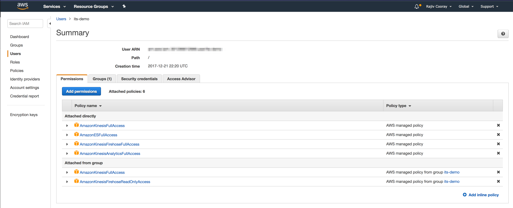
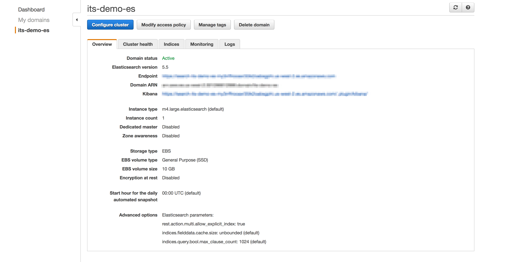
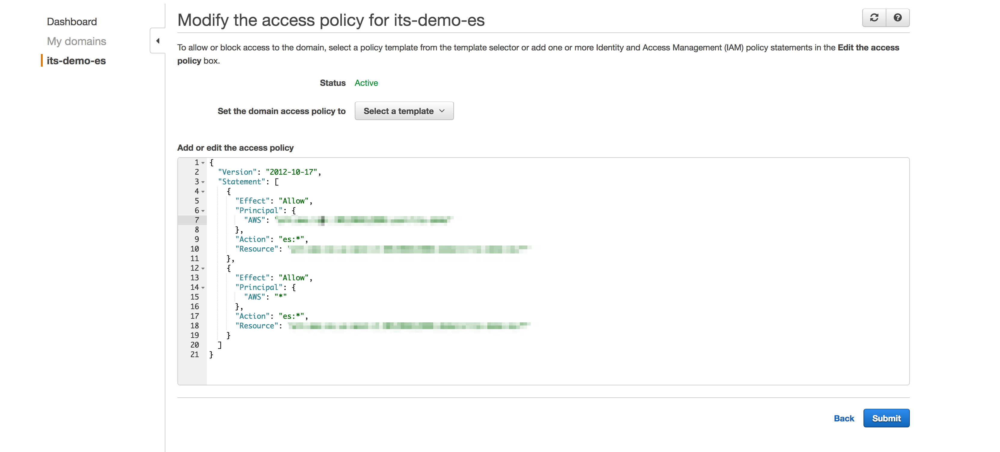
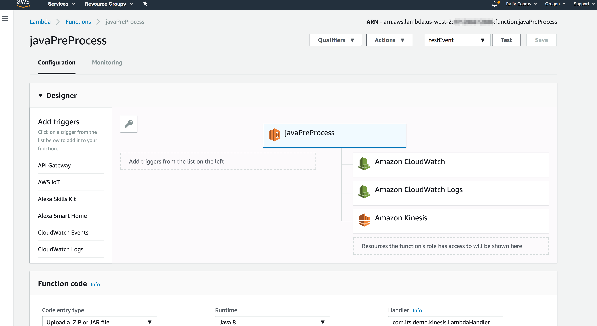
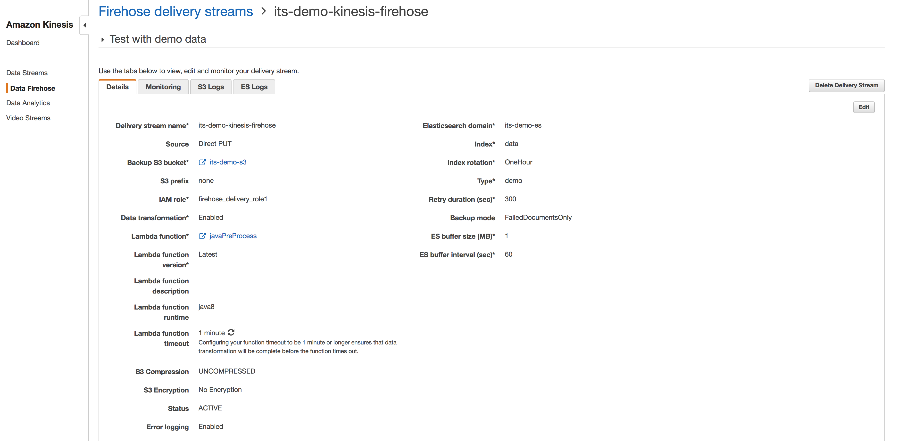
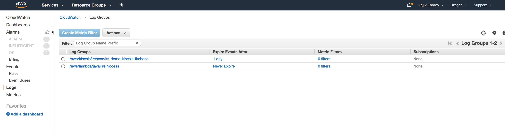
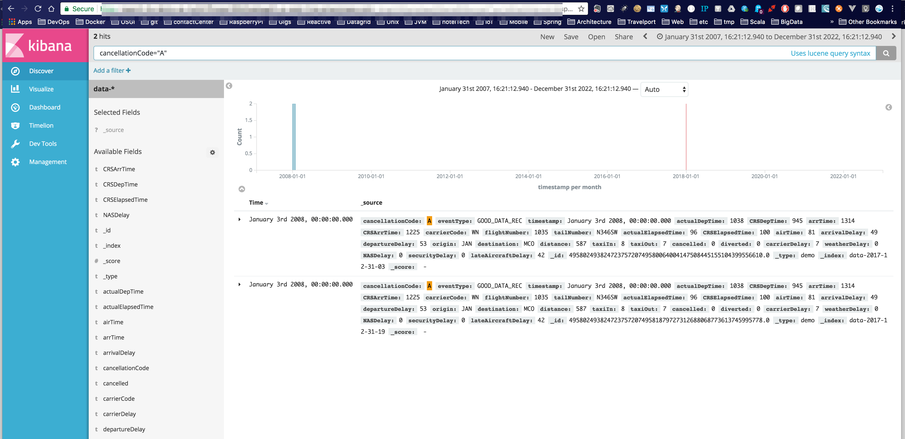
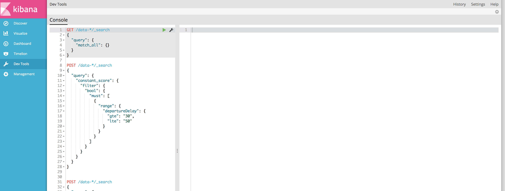

<!-- TOC depthFrom:1 depthTo:6 withLinks:1 updateOnSave:1 orderedList:0 -->

- [Overview](#overview)
	- [How it Works](#how-it-works)
- [Pre-Requisites](#pre-requisites)
	- [Create an IAM User](#create-an-iam-user)
	- [Create the agent.json File](#create-the-agentjson-file)
	- [Create the `credentials` File](#create-the-credentials-file)
	- [Elastisearch & Kibana](#elastisearch-kibana)
	- [Create the Lambda Function](#create-the-lambda-function)
	- [Create the Kinesis Firehose Delivery Stream](#create-the-kinesis-firehose-delivery-stream)
- [End-to-end Testing](#end-to-end-testing)
	- [Upload the Lambda Function](#upload-the-lambda-function)
	- [Data Streaming Using the Scala Application](#data-streaming-using-the-scala-application)
		- [Run the JUnit Test](#run-the-junit-test)
		- [Run Using Gradle](#run-using-gradle)
		- [Run as a Stand-alone Java Application](#run-as-a-stand-alone-java-application)
	- [Data Streaming Using the Kinesis Agent](#data-streaming-using-the-kinesis-agent)
	- [Verifying Kinesis Stream Processing](#verifying-kinesis-stream-processing)
- [Using Kibana to Query Data](#using-kibana-to-query-data)

<!-- /TOC -->

# Overview
This project demonstrates the use of [Amazon Kinesis Data Streams](https://aws.amazon.com/kinesis/?hp=tile&so-exp=below) services for stream data processing. The sample CSV data is from the [Bureau of Transportation Statistics](https://www.transtats.bts.gov/databases.asp?Mode_ID=1&Mode_Desc=Aviation&Subject_ID2=0) and contains airline on-time performance statistical data. The data schema is documented [here.](http://stat-computing.org/dataexpo/2009/the-data.html)

Sample data read from a CSV file can be streamed to the Kinesis Firehose Endpoint using a Scala application that uses the [Kinesis Firehose SDK](https://docs.aws.amazon.com/firehose/latest/dev/writing-with-sdk.html), or the [Kinesis Agent application](https://docs.aws.amazon.com/firehose/latest/dev/writing-with-agents.html) provided by Kinesis. CSV data is then transformed to JSON using an [Amazon Lambda Function](https://docs.aws.amazon.com/lambda/latest/dg/welcome.html) and sent back to the Kinesis Endpoint where it gets sent to an [Amazon Elastisearch Service](https://docs.aws.amazon.com/elasticsearch-service/latest/developerguide/what-is-amazon-elasticsearch-service.html) Endpoint for ingestion.

Use of Amazon Kinesis services can be an alternative approach to using stream processing using [Kafka and Spark Streaming](https://github.com/doinotlikeit/spark-stream-processor).

  


----


## How it Works
* Data can be streamed to Kinesis Firehose using two mechanisms:
  * By running the `KinesisClientApp` as a stand-alone Java application at the command line
  * By staring a Docker container which runs the Kinesis Agent

  Both methods reads the CSV file(s) and streams their contents to the Kinesis Firehose Endpoint. Any processing errors are logged in S3

* The Kinesis Data Streams Endpoint receives streamed input data and invokes the Lambda Java Function which transforms CSV data to a JSON schema that can be ingested to Elastisearch. Debug log output from the Lambda function can be accessed from the CloudWatch service

* Firehose service sends the transformed JSON data to the Elastisearch Service endpoint which indexes the input data by automatically creating new indexes

* Data can queried, analysed, and viewed from the Kibana web console


----


# Pre-Requisites
>
> Amazon Kinesis is a paid service, you must have an Amazon AWS account to created the services below.
>

## Create an IAM User
Access the IAM console and create a User, Group and Security Credentials. Note the Access Key Id and the Secret Key, you need them to access Kinesis services.

  

## Create the agent.json File
Create a file named `agent.json` with the content below in the `PATH_TO_PROJ_DIR]` directory. Change the values as necessary. This file will be added to the Docker image and will be used by the Kinesis Agent at runtime.
```
{
  "cloudwatch.emitMetrics": true,
  "awsAccessKeyId": "Place your Access Key Id",
  "awsSecretAccessKey" : "Place your Secret Key",
  "cloudwatch.endpoint" : "firehose.us-west-2.amazonaws.com",
  "firehose.endpoint" : "firehose.us-west-2.amazonaws.com",
  "flows": [
    {
      "filePattern": "/data/sample.csv",
      "deliveryStream": "its-demo-kinesis-firehose"
    }
  ]
}
```

## Create the `credentials` File
Create the `credentials` file in your home directory with the following content. The Kinesis SDK/client uses this.
```
[default]
aws_access_key_id=Place your Access Key Id
aws_secret_access_key=Place your Secret Key
```

## Elastisearch & Kibana
1. Create the Elastisearch Domain

    Access the Elastisearch Service console and create a new Elastisearch domain.

    

    Be sure that the Access Policy is similar to below.

    


2. Create Data Mappings

    * Elastisearch data mapping is explained [here](https://www.elastic.co/guide/en/elasticsearch/reference/current/mapping.html).

    * Goto `Dev Tools` on Kibana and execute the mapping query below by replacing the `[QUERY_JSON_STRING]` section with the contents of the `[PATH_TO_PROJ_DIR]/data/es-mapping.json` file.

      ```
      PUT _template/data-template

        [QUERY_JSON_STRING]

      ```

## Create the Lambda Function
Access the AWS Lambda Console and create a new Function.




## Create the Kinesis Firehose Delivery Stream
Access the Kinesis Console, navigate to `Data Firehose`, create a new Delivery Stream. You will be using the Elastisearch Service and the Lambda Function in the Delivery Stream.




----


# End-to-end Testing
>
> Be sure to complete all requirements in the Pre-Requisites section.
>

## Upload the Lambda Function
Before using the Kinesis Firehose Streaming service, you must upload the Lambda Function.

1. Build the ZIP file
    ```
    cd [PATH_TO_PROJ_DIR]
    ./gradlew clean build

    ...
    ```

2. Upload the Zip file
    * Access the Lambda Service Console, select `Upload a .ZIP or JAR File`, hit `Upload` to upload the ZIP file from the `[PATH_TO_PROJ_DIR]/build/distributions` directory.

    * Select `Publish New Version` from the `Actions` drop-down and publish the new version of the Lambda Function.


## Data Streaming Using the Scala Application
The Scala Application `KinesisClientApp` scans a specified directory for CSV data files, reads their contents and streams their contents using the Kinesis Client SDK.

### Run the JUnit Test
  ```
    cd [PATH_TO_PROJ_DIR]
    ./gradlew clean test
    Java HotSpot(TM) 64-Bit Server VM warning: ignoring option MaxPermSize=128M; support was removed in 8.0
    Starting a Gradle Daemon (subsequent builds will be faster)

    > Task :compileScala
    Pruning sources from previous analysis, due to incompatible CompileSetup.

    > Task :compileTestScala
    Pruning sources from previous analysis, due to incompatible CompileSetup.

    > Task :test

    LambdaTest > createHandlerTest STARTED

    LambdaTest > createHandlerTest STANDARD_OUT
        ##-> 12:54:45.197 Test worker - INFO - LambdaTest: ==> Initialised ...
        ##-> 12:54:45.199 Test worker - INFO - LambdaTest: ==> Running test ...

    LambdaTest > createHandlerTest PASSED

    LambdaTest > handlerInvocationTest STARTED

    LambdaTest > handlerInvocationTest STANDARD_OUT
        ##-> 12:54:45.439 Test worker - INFO - LambdaTest: ==> Initialised ...
        ##-> 12:54:45.477 Test worker - INFO - LambdaTest: ==> Sending test data: {invocationId=a4e9d125-8831-4840-8b13-5be1a41660c5, deliveryStreamArn=arn:aws:firehose:us-west-2:301286612886:deliverystream/its-demo-kinesis-firehose, region=us-west-2, records=[{recordId=49580249382472375720749578939849415291010732558131396610000000, approximateArrivalTimestamp=1514652614490, data=MjAwOCwxLDMsNCwyMDAzLDE5NTUsMjIxMSwyMjI1LFdOLDMzNSxONzEyU1csMTI4LDE1MCwxMTYsLTE0LDgsSUFELFRQQSw4MTAsNCw4LDAsLDAsTkEsTkEsTkEsTkEsTkE=}]} to Lambda Handler
        ##-> 12:54:45.617 Test worker - INFO - c.its.demo.kinesis.data.TestContext: ==> Created an EventData object
        ##-> 12:54:46.199 Test worker - INFO - c.its.demo.kinesis.data.TestContext: *** Records to return: com.its.demo.kinesis.KinesisDataRecords@4c74b3c4
        ##-> 12:54:46.199 Test worker - INFO - c.its.demo.kinesis.data.TestContext: *** Handler call count: 1
        ##-> 12:54:46.202 Test worker - INFO - LambdaTest: ==> Record id: 49580249382472375720749578939849415291010732558131396610000000, Result: Ok, data: eyJldmVudFR5cGUiOiJHT09EX0RBVEFfUkVDIiwidGltZXN0YW1wIjoiMjAwOC0wMS0wM1QwMDowMCIsImFjdHVhbERlcFRpbWUiOiIyMDAzIiwiQ1JTRGVwVGltZSI6IjE5NTUiLCJhcnJUaW1lIjoiMjIxMSIsIkNSU0FyclRpbWUiOiIyMjI1IiwiY2FycmllckNvZGUiOiJXTiIsImZsaWdodE51bWJlciI6IjMzNSIsInRhaWxOdW1iZXIiOiJONzEyU1ciLCJhY3R1YWxFbGFwc2VkVGltZSI6MTI4LCJDUlNFbGFwc2VkVGltZSI6MTUwLCJhaXJUaW1lIjoxMTYsImFycml2YWxEZWxheSI6LTE0LCJkZXBhcnR1cmVEZWxheSI6OCwib3JpZ2luIjoiSUFEIiwiZGVzdGluYXRpb24iOiJUUEEiLCJkaXN0YW5jZSI6ODEwLCJ0YXhpSW4iOjQsInRheGlPdXQiOjgsImNhbmNlbGxlZCI6MCwiY2FuY2VsbGF0aW9uQ29kZSI6Ik5BIiwiZGl2ZXJ0ZWQiOjAsImNhcnJpZXJEZWxheSI6MCwid2VhdGhlckRlbGF5IjowLCJOQVNEZWxheSI6MCwic2VjdXJpdHlEZWxheSI6MCwibGF0ZUFpcmNyYWZ0RGVsYXkiOjB9
        ##-> 12:54:46.203 Test worker - INFO - LambdaTest: ==> Test Done ...

    LambdaTest > handlerInvocationTest PASSED
  ```

### Run Using Gradle
  ```
    cd [PATH_TO_PROJ_DIR]
    ./gradlew clean run
    Java HotSpot(TM) 64-Bit Server VM warning: ignoring option MaxPermSize=128M; support was removed in 8.0

    > Task :compileScala
    Pruning sources from previous analysis, due to incompatible CompileSetup.

    > Task :run
    ##-> 22:35:18.120 main - INFO - c.its.demo.kinesis.KinesisClientApp$: ==> Created the Firehose client, data directory to scan: [/Users/coorayr/its/demo/kinesis-stream-processing/data] ...
    ##-> 22:35:18.127 pool-2-thread-1 - INFO - c.its.demo.kinesis.DirectoryScanner: ===> Thread [pool-2-thread-1], Scanning: /Users/coorayr/its/demo/kinesis-stream-processing/data ...
    ##-> 22:35:18.140 pool-2-thread-1 - INFO - c.its.demo.kinesis.DirectoryScanner: ===> Found: 1 files in the source directory: [/Users/coorayr/its/demo/kinesis-stream-processing/data], can read|execute: [true|true]
    ##-> 22:35:18.141 pool-2-thread-1 - INFO - c.its.demo.kinesis.DirectoryScanner: ===> Thread: [pool-2-thread-1], Processing file: [/Users/coorayr/its/demo/kinesis-stream-processing/data/sample.csv]
    ##-> 22:35:18.141 pool-2-thread-1 - INFO - c.its.demo.kinesis.DirectoryScanner: ===> Data file: [sample.csv], size: 0 MB ...
    ##-> 22:35:18.142 pool-2-thread-1 - INFO - c.its.demo.kinesis.DirectoryScanner: Percentage complete: 0%,  Lines in queue: 0, lines read: 0
    ##-> 22:35:18.142 pool-2-thread-1 - INFO - c.its.demo.kinesis.DirectoryScanner: Percentage complete: 9%,  Lines read from file: 54
    ##-> 22:35:18.142 pool-2-thread-1 - INFO - c.its.demo.kinesis.DirectoryScanner: ===> Total lines in file: 54 lines
    ##-> 22:35:18.142 pool-2-thread-1 - INFO - c.its.demo.kinesis.DirectoryScanner: ===> File size: 5203, read size: 5149
    ##-> 22:35:18.142 pool-2-thread-1 - INFO - c.its.demo.kinesis.DirectoryScanner: ===> **********************************************************************************
    ##-> 22:35:18.142 pool-2-thread-1 - INFO - c.its.demo.kinesis.DirectoryScanner: ===> Thread: [pool-2-thread-1], Finished Processing file: [/Users/coorayr/its/demo/kinesis-stream-processing/data/sample.csv]
    ##-> 22:35:18.142 pool-2-thread-1 - INFO - c.its.demo.kinesis.DirectoryScanner: ===> **********************************************************************************
    ##-> 22:35:20.164 main - INFO - c.its.demo.kinesis.KinesisClientApp$: ===> Put record (Async) to Kinesis: Sb5T6esQC6gs+ZHiH8+RwbuWQOLP5BZIvdsKe+5i6uWkES3TVEHEytQTubKD8gMMxWD6s22gReFKDATA2SaJ2N/kMNLdPnA/i4F2nkwMbWgOY/jL69ojuMmFN8K1brCGLf9LV0Tc23Y1Avx2M3okoT2pLC27oERc0S9FnRiSGPi/YbT+eKiW2ZA6QKaEWd5kooQ1Ye8EJm+oVx2opBG56rJnqFbyOKR/ ...
    ##-> 22:35:20.326 main - INFO - c.its.demo.kinesis.KinesisClientApp$: ===> Put record (Async) to Kinesis: DsFp0sqacR0+XP77axYPGeJzoqsyDHOYaybZSvAA3LOP6vNNhNs+BfOPqm7dhM4jaY6BTK5mc80H7JsQanH3VOFBW4VU/I/tWcnOsR2ILu5JnaqiDfB4r1OskIGTpFClB3weMJCMQS5OUVVhZBkyGH0MKoHGd+EV4U+damp2rvZNDr6s/FmcTulfnWAeuMHzi3KkS2/F8RoG135R5wkcACRFerhQPnZh ...
    ##-> 22:35:20.498 main - INFO - c.its.demo.kinesis.KinesisClientApp$: ===> Put record (Async) to Kinesis: mfExH37nOTaY5b/N8kVE4w1thsQAtUpWvjwv7a2rvUwp7ikIbC+QON8kS8GQ82VXCCTV+2i6PawRm/3FWwdw2DIsWA8VPtWzc99gbOxOtFoS4FcBHJJRZAl+zv0hhnWXB

    ...
  ```

### Run as a Stand-alone Java Application
Build the application Jar file:
  ```
    cd [PATH_TO_PROJ_DIR]
    ./gradlew clean kinesis
    Java HotSpot(TM) 64-Bit Server VM warning: ignoring option MaxPermSize=128M; support was removed in 8.0

    > Task :compileScala
    Pruning sources from previous analysis, due to incompatible CompileSetup.

    > Task :compileTestScala
    Pruning sources from previous analysis, due to incompatible CompileSetup.

    ...
  ```
Run as a stand-alone Java app at the command prompt:
  ```
    cd [PATH_TO_PROJ_DIR]
    java -jar build/libs/kinesis-stream-processing-1.0.0-SNAPSHOT.jar `pwd`/data
    ##-> 13:38:29.036 main - INFO - c.its.demo.kinesis.KinesisClientApp$: ==> Created the Firehose client, data directory to scan: [/Users/coorayr/its/demo/kinesis-stream-processing/data] ...
    ##-> 13:38:29.041 pool-2-thread-1 - INFO - c.its.demo.kinesis.DirectoryScanner: ===> Thread [pool-2-thread-1], Scanning: /Users/coorayr/its/demo/kinesis-stream-processing/data ...
    ##-> 13:38:29.052 pool-2-thread-1 - INFO - c.its.demo.kinesis.DirectoryScanner: ===> Found: 1 files in the source directory: [/Users/coorayr/its/demo/kinesis-stream-processing/data], can read|execute: [true|true]
    ##-> 13:38:29.052 pool-2-thread-1 - INFO - c.its.demo.kinesis.DirectoryScanner: ===> Thread: [pool-2-thread-1], Processing file: [/Users/coorayr/its/demo/kinesis-stream-processing/data/sample.csv]
    ##-> 13:38:29.053 pool-2-thread-1 - INFO - c.its.demo.kinesis.DirectoryScanner: ===> Data file: [sample.csv], size: 0 MB ...
    ##-> 13:38:29.053 pool-2-thread-1 - INFO - c.its.demo.kinesis.DirectoryScanner: Percentage complete: 0%,  Lines in queue: 0, lines read: 0
    ##-> 13:38:29.054 pool-2-thread-1 - INFO - c.its.demo.kinesis.DirectoryScanner: Percentage complete: 9%,  Lines read from file: 54
    ##-> 13:38:29.054 pool-2-thread-1 - INFO - c.its.demo.kinesis.DirectoryScanner: ===> Total lines in file: 54 lines

    ...
  ```

## Data Streaming Using the Kinesis Agent
Amazon Kinesis provides an Agent Java application that can run as a daemon. Similar to the Scala application above, the Agent scans a specified directory for CSV data files, reads their contents and streams their contents using the Kinesis Client SDK. The Docker image installs the Agent application and the resulting Docker container runs the Agent daemon.

1. Build the Docker image
    ```
    cd [PATH_TO_PROJ_DIR]
    ./gradlew clean docker
    Java HotSpot(TM) 64-Bit Server VM warning: ignoring option MaxPermSize=128M; support was removed in 8.0

    BUILD SUCCESSFUL in 3s
    ```
    > Note: It might up to 10 minutes or more to build the image the first time you run the above command.

2. Run the Docker Container
    ```
    cd [PATH_TO_PROJ_DIR]
    docker run  --rm=true  -v [PATH_TO_PROJ_DIR]/data:/data -it --name=agent kinesis-stream-processing
    ```

3. Verify Container Startup
    ```
    cd [PATH_TO_PROJ_DIR]
    docker ps -a

    CONTAINER ID        IMAGE                       COMMAND                  CREATED             STATUS              PORTS               NAMES
    4280ac59f56e        kinesis-stream-processing   "sh -c start-aws-k..."   6 seconds ago       Up 8 seconds                            agent
    ```

4. Tail Agent's Log File
    ```
    cd [PATH_TO_PROJ_DIR]
    docker exec -it agent  tail -f /var/log/aws-kinesis-agent/aws-kinesis-agent.log

    ...
    ```

## Verifying Kinesis Stream Processing
Access the CloudWatch console, navigate to `Logs` to view the log files.




----


# Using Kibana to Query Data





Below queries can be from the `Dev Tools` tab in Kibana.

* Search all flights that incurred a departure delay >= 30 mins and =< 50 mins
  ```
  POST /data-*/_search
  {
    "query": {
      "constant_score": {
        "filter": {
          "bool": {
            "must": [
              {
                "range": {
                  "departureDelay": {
                    "gte": "30",
                    "lte": "50"
                  }
                }
              }
            ]
          }
        }
      }
    }
  }
  ```

* Search for flights with the cancellation code `A` = carrier; flights that were cancelled due to carrier
  ```
  POST /data-*/_search
  {
    "query": {
      "constant_score": {
        "filter": {
          "bool": {
            "must": [
              {
                "term": {
                  "cancellationCode": "A"
                }
              }
            ]
          }
        }
      }
    },
    "aggs": {
      "byCarrier": {
        "terms": {
          "field": "carrierCode"
        }
      }
    }
  }
  ```

* Other useful queries
  * Get index info
    ```
    GET /data-*/_stats/store
    ```

  * Cluster info
    ```
    GET /_cluster/state
    ```

  * More on indexes
    ```
    GET /_cat/indices?v
    ```

  * Delete all indexes - use with caution
    ```
    DELETE data-*
    ```
